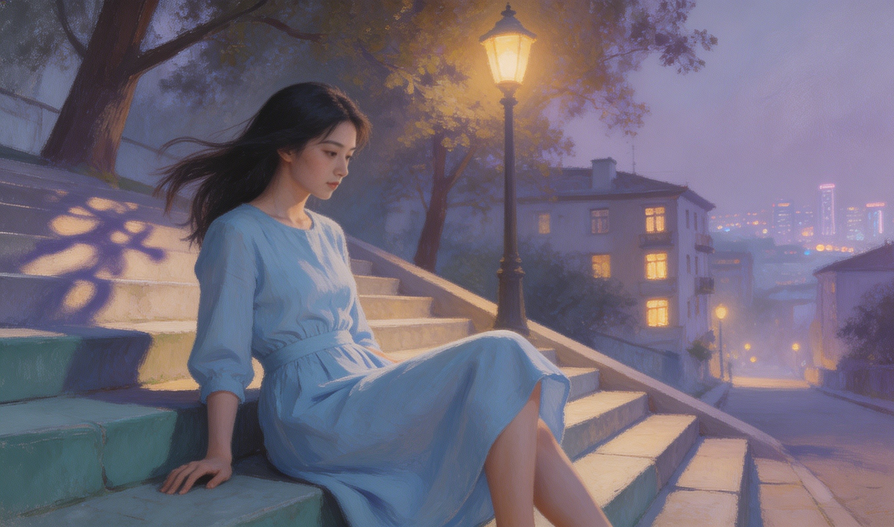
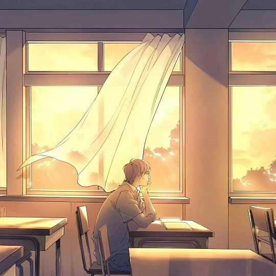

搭配音乐：<audio controls src="/assets/music/秘密.mp3" title="Title"></audio>

“大家好，我叫苏念，念念不忘的念。”

她说这句话的时候，九月的风恰好从半开的窗户里灌进来，把她的马尾辫吹得往左边歪了一下。她站在讲台上，穿着的校服明显大了一个号，袖口往下垂着盖住了半个手掌，只露出一截细白的手指头，指尖不安分地绞着衣角。阳光从她身后打过来，把她整个人勾勒成一道毛茸茸的剪影，发丝的边缘泛着淡金色的光，像镀了一层薄薄的蜜。

.jpg)

然后她笑了。嘴角往上弯起一道弧线，左边脸颊上旋出一个梨涡，浅浅的，像谁用指尖在柔软的沙子上轻轻按了一下。眼睛弯成两弯月牙，眼角眉梢都是活泼泼的、明晃晃的、藏都藏不住的笑意。

“我喜欢笑。”她顿了顿，像在确认这个结论似的又点了点头，还自顾自地补了一句，“他们说笑起来好看。”

全班哄地笑起来，有人鼓掌，有人吹了声口哨。气氛像被一支火柴划亮了似的，原来陌生的、拘谨的教室里忽然就松快起来。

只有我没笑。我坐在靠窗第三排的位置上，像被人施了定身术一样僵在椅子里。她的目光刚好扫过整个教室，像舞台上的追光灯一样从每个人脸上滑过去，滑到我这儿的时候，我的胸腔里发出一声巨大的、只有我自己听得见的轰响，像有什么东西从高处坠落下来，砸在我心脏最柔软的那块地方。

笔从我的指间滑了下去，骨碌碌滚过桌面，啪嗒一声掉在地上。同桌用胳膊肘捅了我一下：“陈屿，你眼睛都直了。”我弯下腰去捡笔，手抖得像个帕金森患者，指尖在地面上摸索了好几下才够着那根无辜的黑色水笔。抬起头的时候正撞上她走下讲台时随意扫过来的视线，她又笑了一下。那个笑比起刚才那个更加不经意，像是阳光从树缝里漏下来，正好落在我身上。我整张脸从脖子根红到了耳尖，烫得像发烧四十度，慌忙低下头把笔尖戳在草稿纸上，画了一个歪歪扭扭的圈。

那天之后，所有的事情都变得不一样了。

我以前的生活是一张白纸，上面画着几条寡淡的线：上课、做题、回家、打游戏。偶尔有一两道彩色的划痕，也不过是期中考试名次进步了，或者冬天食堂新出了红烧排骨。那种日子平静得就像一潭死水，随便扔什么进去都不会起波澜。可她出现以后，那张纸像是被人展开揉碎了重新拼贴过一遍，每一个角落都藏着一小簇跳动的光。

每天早上推开教室门的第一个动作，我的眼睛会自己找到她的座位。这是我最诚实的身体反应，像呼吸一样不需要思考。如果她已经在座位上了——正歪着头跟同桌说话，眉飞色舞的样子，两只手跟着比划，银铃铛叮叮当当地响；或者正低头整理书桌，把课本一本一本从书包里掏出来，动作慢条斯理的，马尾辫随着低头的弧度从肩头滑下来，像一道安静的黑色瀑布——我这一整天的心情就有了底色，是暖黄色的。

如果她的座位空着，我的心就吊起来，悬在半空中晃荡。我坐在自己位子上，表面上是翻开了英语课本，实际上每隔几秒钟就瞟一眼门口。走廊里每一声脚步声都让我神经紧绷，我会用眼睛余光研究每一个从门口经过的身影，猜哪一个是她。有一次我差点站起来冲过去，结果进来的是班主任老刘，抱着一沓卷子说“随堂测验”，吓得我出了一背的冷汗。她总是踩着上课铃冲进来，校服拉链只拉到一半，书包斜挎在一侧肩膀上，整个人风风火火的，额头上沁着细密的汗珠。她进门的时候会先顿一下，扫一眼讲台上的老师，如果是老刘她就会缩缩脖子吐吐舌头，然后猫着腰小跑回座位。那个缩着脖子吐舌头的表情，像某种草原上的小动物，灵动得让人想伸手揉揉她的脑袋。

她爱笑，那是真的。我后来发现，她笑起来是没有规律的、不可预测的，像一场随时可能落下来的太阳雨，你永远不知道下一滴会砸在哪个瞬间。

语文老师是一个头发花白的老头，讲课的时候经常冒出一些毫无来由的感慨，比如“这个字写歪了，跟你们的人生一样没有规划”。全班六十多个人六十多张麻木的脸，只有她笑出声来。是那种很细碎的、从喉咙里溢出来的笑声，像一粒珍珠滚在瓷盘上，清脆又克制。我总在想，她笑点到底在哪里？她为什么总能从最平常的话里找到笑料？

后来我想通了，她的笑就像一种天赋，一种不需要理由的、与生俱来的东西，就像向日葵会跟着太阳转，含羞草被碰了会合起来。她看到这个世界的方式跟我不一样，她总能从一堆灰扑扑的日常里挑出那一点点亮的、有趣的、值得高兴的部分，然后把它放大、拉长，笑成一串哗啦啦的声音，像在平淡的日子里撒满了一把碎玻璃糖。

体育课八百米测试，她永远是最后一个。别人都冲过线了，她还在距离终点三四十米的地方挣扎，额头上的汗把刘海黏在脑门上，整张脸红得像是要炸开，呼吸重得跟拉风箱一样。可每次老师冲她喊“跑起来跑起来”的时候，她还会抬起头来笑一下，摆摆手说“跑着呢跑着呢”。就是那种狼狈到极致、好像下一秒就要趴在地上起不来了的时候，她的脸还能挤出笑来，眼睛眯着，梨涡像两个小括号括住了她的痛苦。

过了线，她不忙着喝水，先扶着膝盖喘一会儿，然后把头抬起来，看着周围围过来的同学说：“哎呀，我又垫底啦。但是你们想，我这是替你们所有人在垫底，没有我垫着，你们哪能冲得那么快。我这是在用生命成就你们啊。”她笑起来，嗓子还是哑的，喘得断断续续，可那个笑却无比灿烂，像跑完了不是八百米而是跑赢了整个夏天。

我递水给她的时候，她接过去仰头就灌，嘴角有水淌下来，顺着下巴滑到脖子上，在阳光里亮晶晶的。她喝完了把瓶子往我手上一塞，冲我笑着说“谢啦”，然后转了个身，做出一副要倒下去的样子：“不行了不行了，我要原地去世了。”她室友架着她往回走，她脚底下软得像是踩在棉花上，可还在笑。

我在后面看着她的背影，马尾辫散了一半，歪歪斜斜地耷拉在肩膀上，校服后襟湿了一大片，可她的肩胛骨在笑的时候一抖一抖的，像两只振翅欲飞的鸟。

就是这些无数个微小的、别人可能根本不会注意到的瞬间，构成了我的整个十七岁。我的生活被她的笑容切割成了无数个细小的瞬间，每一个瞬间里都有她——她嘴角翘起来的弧度、她梨涡陷下去的深浅、她笑弯了的眼睛里那一小片雾蒙蒙的光。

那天下午最后一节课是自习，教室里安安静静的，只有翻书声和笔尖划过纸面的沙沙声。暖气还没来，深秋的凉意从窗缝里一丝一丝地渗进来。我做完一张英语卷子抬起头活动脖子的时候，看见苏念侧着脸对着窗外。

她没在看书。她的课本摊在桌上，笔夹在手指间一动不动，整个人保持着一种凝固的姿势，侧脸对着窗户，目光落在窗外很远的地方。窗外是一排光秃秃的梧桐树，叶子掉了一大半，剩下几片枯黄的挂在枝头，风一吹就颤巍巍地抖。更远处是灰白色的天空，云层压得很低，沉沉地铺着，像一块洗旧了的棉布。她就那么看着，看了很久很久，久到我做完一整道数学大题再抬头的时候，她的姿势几乎没有变过，只是下巴换了个角度，搭在支起来的手背上。

那个画面让我心里忽然紧了一下。她平时哪怕是发呆，嘴角也带着一点似有似无的弧度，好像是笑长在了脸上成了习惯。可那天下午她侧脸的线条很平，嘴角没有翘起来，梨涡也不见踪影，只是安安静静地看着窗外灰蒙蒙的天，像一尊蒙了薄薄一层灰的瓷器，失去了平时那种亮亮的光泽。

下课铃响了，教室里开始嘈杂起来，有人收拾书包有人讨论晚饭吃什么有人趴在桌上补觉。她慢慢转回身，开始把桌上的东西往书包里收，动作很慢很慢，像在走神。同桌跟她说了句什么，她转过头，嘴角扯了一下——那是一个我没有见过的弧度，说不上是笑，顶多算是一个回应，梨涡没有出现，眼睛也没有弯。

放学的时候我在走廊里跟她迎面碰上。她背着书包低着头走路，银铃铛垂在手腕上没有响。我叫了她一声：“苏念，走这么急干嘛？”

她抬起头看见是我，嘴角立刻习惯性地往上弯了弯：“哦，今天有点事，想早点回家。”那个笑是标准的、程序化的，像按了一个开关，跟平时面对全班所有人时用的笑脸一模一样，梨涡浅浅地浮出来一下就回去了，像是应付差事。

我没多问，侧身让了路。她从我身边走过去的时候风带起来，我闻到一股淡淡的桔子味，可能是她口袋里装了什么桔子味的东西。她走出几步之后铃铛才终于响了一下，很轻，像叹了一口气。

那天我站在走廊里看她走远，心里那个模糊的念头第一次变得具体而清晰。我想替她做点什么，想让她不用在我面前摆出那张标准笑脸，想让她知道有人看得出来她今天不太对劲。可我不知道该怎么做。我总不能冲上去问“你今天为什么不开心”，那样她肯定又要笑一下说“没有啊我挺好的”。

后来我慢慢想明白了一件事。每个人消化情绪的方式不一样，她选择安安静静看着窗外的时候，我要做的也许只是在旁边站着，不用说什么做什么，让她知道有人在就行了。

第二天早上我比平时早到了十五分钟。教室里没几个人，她的座位空着。我走过她桌子的时候犹豫了一下，从口袋里掏出一颗糖放在她笔袋旁边——就是那种很普通的桔子味硬糖，昨天放学路上在校园超市顺手买的，两块钱一小包。我也不知道为什么要放，放完就后悔了，觉得自己像个傻子。但糖已经搁在那儿了，再拿回来更奇怪。我快步走回自己座位坐下，翻开英语课本假装在背单词，耳朵支棱着听门口的动静。

她来的时候铃铛叮叮当当地响了一路。走到座位边把书包放下，然后顿了顿。我余光瞥见她拿起那颗糖看了看，翻来覆去地转了两圈。我以为她要把糖丢掉或者随手塞进口袋，但我听见了一声很轻的笑——跟昨天走廊里那个程序化的笑完全不一样，很轻很短，但里面有真的东西。

她剥开糖纸把糖丢进嘴里，回头往教室后面扫了一眼。我迅速低下头埋进课本里，整张脸烫得能煎鸡蛋。那颗糖纸被她对折了一下压在笔袋下面，从那天起一直压在那儿，直到学期末换座位的时候才被收走。

后来我渐渐学会了观察她的状态。不是每天放糖，那也太傻了，只是在她对着窗外发呆的第二天早上偶尔放一颗。有时候是桔子味，有时候是薄荷味，有一次是那种包着糯米纸的太妃糖，我也不知道她喜不喜欢，就是觉得包装很好看，买了一盒，挑了一颗最漂亮的放在她桌上。她每次发现了都会笑一下，然后剥开吃掉，糖纸叠好压在笔袋底下。我们之间从来没有就此说过任何话，我从来没承认过那是我放的，她也从来没问过。但那个小小的动作成了一种无声的默契，就像一种暗号，我在用笨拙的方式说“我看到了，我知道你今天状态不太好”，她用吃掉糖的动作回答“嗯，谢谢你看到了”。

---

那天下午最后一节课结束后天已经快黑了，冬天的太阳落得早，不到五点窗外的光线就变成了灰蓝色的薄暮。教室里的同学陆陆续续走了，我留下来值日，扫地扫到一半去走廊尽头的水房洗拖把。路过走廊中间那扇窗户的时候，我看见苏念站在窗边，两只手撑在窗台上，微微前倾着身子，额头几乎要贴上冰凉的玻璃。

窗外已经全黑了，路灯还没亮，只有远处教学楼的几扇窗户透着光。她盯着外面看，玻璃上倒映着她的脸和身后走廊的灯，两层影子叠在一起，模模糊糊的。她没发现我。

我站在她身后几步远的地方停住了。拖把上的水一滴一滴落在地上，发出小小的声响。她就那么站着，安安静静的，肩膀平直，呼吸均匀，不像在哭，也不像在难过。就只是站着看外面，好像外面那片灰蒙蒙的夜里有她正在等的东西。

我犹豫了很久要不要走过去。最后我把拖把靠在墙上，走上去在她旁边站定了，学着她也撑着窗台往外面看。窗玻璃凉凉的，冰得掌心生疼。她偏过头看了我一眼，嘴角动了一下，那种想笑但又懒得笑的表情，梨涡没有出现。

“外面有什么好看的？”我问。

她沉默了几秒钟，然后把下巴搁在手背上，重新看向窗外：“我在数对面楼有几盏灯亮着。”她的声音很平静，没有鼻音，没有颤抖，“从七楼往下数，亮灯的窗口今天晚上比昨天少了三个。那户六楼左边的人家平时窗帘拉得很早，今天到现在还开着灯，可能是家里有人还没回来。”

我不知道该怎么接。她就那么平平淡淡地说着这些无关紧要的观察，语气和平时判若两人，没有了那些逗人笑的欢快尾音，也没有了硬撑出来的元气。她就只是陈述事实，像在做一道不需要答案的填空题。

“我今天不想笑。”她说。语气很淡，像是告诉我明天可能会下雨一样平常。“所以你别逗我，我今天笑不出来。”

“我不逗你。”我说。

她又偏过头来看我一眼。走廊里很暗，只有尽头一盏白炽灯照着，她大半个脸在阴影里，只有眼睛反射着一点光。“你在这儿站着干嘛？又不说话。”

“陪你站着。”

“站到什么时候？”

“站到你不想站了为止。”

她沉默了一会儿，然后把脸转回去继续看窗外。但嘴角那个平直的线条似乎松了一点，像拧紧的弦被人轻轻拨了一下。

那天我们在走廊窗边站了很久，久到她终于把脸从手背上抬起来，搓了搓被玻璃冰红了的掌心，伸了个懒腰——那个懒腰让她的脊椎咔咔响了两声，她缩了缩脖子：“冻死我了，走了走了。”她转身往楼梯口走，走了两步回头看了我一眼，路灯这时候正好亮了，橘黄色的光照进走廊，在她脸上铺了一层暖色。她终于笑了，梨涡浅浅的，眼角有一点弯，“陈屿，谢谢你啊。”

“谢我站着啊？”

“嗯，谢你站着。”她说，“走了，明天见。”

她下楼的时候银铃铛叮叮当当地响了一路，听起来比刚才清脆多了。

那天晚上我骑车回家的路上一直在想她最后那个笑。不是那种标准的、应付所有人的笑，是很淡的、从底下慢慢浮上来的笑，像冬天湖面冰层下面有一条鱼游过，从上面看不出动静，但你知道下面是活的。我从那一刻起就知道了一件事——我愿意陪她站很久，不管窗外是黑夜还是白天，不管她说不说话笑不笑，我都愿意在她旁边站下去。

后来我发现她其实经常一个人站在走廊窗边。有时候是课间，同学们都在打闹聊天，她就一个人靠着窗台看外面，手指无意识地在玻璃上画圈。有时候是中午，别人都去食堂了，她晚走几分钟，站在窗前看操场上的人走来走去。我从来没在那些时候刻意走过去找她，只是在经过的时候放慢脚步，有时候她注意到我了会轻轻抬一下下巴算是打招呼，有时候她没注意到我我就直接走过去，不多看不多问。我想让她知道那个空间对她来说是安全的，不会有人闯进去问她“你怎么了”，不会有人打破那种安静。

但我会在她回到座位上之后，隔一两天，趁她不在的时候在她笔袋旁边放一颗糖。有时候连着放两天，有时候隔三四天。没有规律，全凭感觉。糖纸颜色不一样，味道也不一样，她吃完了就把糖纸整整齐齐地叠好，压在笔袋底下。学期快结束的时候我趁她出去接水的功夫偷偷看了一眼，那沓糖纸摞了薄薄一沓，桔色的、绿色的、红色的、黄色的，压得整整齐齐。

高三下学期她嗓子因为紧张上火总是不舒服，说话声音偶尔带着沙哑，但还硬撑着笑。我买了一盒润喉糖，每天往她笔袋里塞一颗，有时候是薄荷味，有时候是蜂蜜柠檬味。她发现后从笔袋里掏出糖，转过头看了我一眼，什么也没说，只是把糖剥了放进嘴里，然后含含糊糊地笑了一下，梨涡浅浅的，像水面上将散未散的涟漪。

有一次她重感冒请了三天假。那三天我整个人的魂像被抽走了，上课完全听不进去。物理笔记记串了化学公式，英语默写错了八个单词，被老师叫到办公室训了一顿：“陈屿你最近怎么回事？心都飞哪儿去了？”我低着头说“没睡好”，其实心里在想她有没有按时吃药、烧退了没有、嗓子还疼不疼。

第三天放学后我没忍住，骑车绕了大半个城找到她家楼下。她家住在一栋老居民楼的五楼，楼道的灯坏了，黑漆漆的，我在楼下的电话亭里投了硬币，拨通了之前偷偷记下来的她家座机号码。电话响了三声就被接起来了，她的声音从那头传过来，沙沙的，像踩在碎叶子上，还带着浓重的鼻音：“喂？哪位？”

我攥紧话筒，手心全是汗，声音有点发抖：“是我，陈屿。听说你病了，好点了吗？烧退了没有？有没有按时吃药？嗓子还疼不疼？”

电话那头安静了很长时间，大概有七八秒，每一秒都漫长得像一个世纪。我紧张得能听见自己血液在耳朵里奔流的声音。然后我听见她笑了——隔着电话线，隔着电流，隔着老居民楼斑驳的墙壁和五层楼梯，即使嗓子哑得像砂纸磨过，那笑声还是一串小铃铛，磕磕绊绊地传进我的耳朵，清脆得让我鼻子发酸。

“陈屿，”她慢悠悠地喊我的名字，每一个音节都拖得很长，“你怎么知道我家的电话号码？”

我的大脑飞速运转，嘴比脑子还快：“……问班主任要的。”

“骗人。”她笑了一声，然后咳了两下，声音里笑意更浓了，“班主任才不会随便把学生家庭电话给另一个学生呢，学校有规定的。你是不是偷偷翻过花名册？还是之前填家庭信息表的时候你坐在我后面偷看了？”

我握着话筒彻底说不出话，嘴唇张了又合合了又张，像一条缺氧的鱼。她那边似乎笑得更开心了，从电话里都能想象出她靠在床头、眯着眼睛、梨涡深陷的样子。“好啦好啦，不逗你了。我好多了，烧昨天就退了，明天应该就能去上学。”她停了一下，声音里那点调皮忽然收了，换了一种很轻很软的语气，“对了，陈屿，我问你个事，你老老实实回答我——你是不是每天偷偷在我座位上放糖的那个人？”

那天晚上我骑车回家的路上，深秋的风裹着落叶扑在脸上，很冷很冷，但我的整张脸烫得像发了高烧，烧到后脑勺都在冒热气。路灯一盏一盏从头顶掠过，梧桐叶的影子被投在地面上，忽远忽近地晃动，像极了我心里那簇正在悄悄盛开却始终不敢承认的东西。我骑得飞快，风把校服吹得鼓起来，我大声哼着歌，喉咙里发出的声音连自己都不知道是什么调。

日子就这么一天一天往前淌，像教学楼后面那条不紧不慢的小河，表面上风平浪静，底下暗流涌动。

高考前那个晚上，全班在教学楼顶楼放孔明灯。那是高三一年里最放松的一个夜晚，大家把复习资料摞在脚下摞成几沓，仰着头看一盏一盏橘红色的灯升上夜空。风比想象中大，把她的碎发吹得乱七八糟，她一边用手拨开一边仰头看，眼睛里映着那些渐行渐远的光点，像盛了一把碎星星。

“好紧张啊，”她小声说，“万一考砸了怎么办？万一去不了想去的城市怎么办？”

“不会的。”我说，风灌进校服把我吹得背后发凉，但我一点也没觉得冷，“你那么聪明，模拟考那么多次都稳在前十，这次肯定没问题。你要相信你自己。”

她偏过头看我。路灯从侧面照过来，在她脸上打出一半明一半暗的轮廓，那双眼睛亮得惊人。“陈屿，”她忽然安静下来，“我有时候觉得你比我自己还相信我。每次我对着窗户发呆的时候你从来不问，但第二天总有一颗糖在我笔袋旁边。”她顿了一下，笑了，是那种很真实的笑，梨涡在路灯底下清清楚楚，“你是不是以为我不知道是你放的？”

我的耳朵噌一下就烧起来了，张了张嘴愣是发不出声。她看着我窘迫的样子笑得更开心了，肩膀都在抖：“你每次放完糖回到座位上就赶紧低头假装看书，耳朵红到脖子根，我又不瞎。”她转过身正对着我，把两只手背在身后，微微踮了一下脚尖，“但是陈屿，谢谢你。每次那颗糖来的时候，我心情都会变好一点。”

我用了好大的力气才开口，声音都劈了：“……你知道就行了，别声张。”

她笑得弯了腰。那个笑声跟平时的都不一样，没有用力过猛，没有表演成分，就是好听的、放松的、从心底漫上来的笑，清脆得让旁边几个放孔明灯的同学都转头看了她一眼。她直起身的时候眼睛还弯着，伸手拢了一下被风吹乱的头发，腕上的银铃铛响了，叮的一声。

“陈屿，”她的声音忽然轻了下来，“我有时候觉得，你是全班最了解我的人。我不用说什么，你就知道我今天需不需要一颗糖。”

我盯着她脚尖前面的一块地砖，心跳声大得怕她听见。“因为，”我说，“因为你值得啊。”

她沉默了很久。风从我们之间穿过去，把她的碎发吹到脸上，她没有拨开，就透过那几缕碎发看着我。然后她笑了一下，很轻很轻，像一片树叶落在水面上，涟漪很小，圈圈散开了就看不见了，但水底有什么东西动了一下。

“你知道吗，”她说，“你是我见过最温柔的人。以后谁要是做了你的女朋友，一定会被你宠成小孩。”

那句话像一枚图钉，不偏不倚钉在我心脏最软的地方。我想说“那个人为什么不能是你”，那句话就在舌尖上打转，滚烫的，差一点点就要脱口而出。但我咽了回去。我不想在高考前给她任何压力，不想让她走进考场之前还要想“陈屿跟我说了那些话我该怎么回应”。那时候我以为喜欢一个人就是让她轻装上阵，让她飞得高一点，哪怕最后飞到我看不见的地方。

高三毕业那年暑假，我们和几个关系好的同学一起出去玩了一趟，两三天，住在郊区一个民宿里，白天爬山晚上烧烤。最后一个晚上大家坐在院子里看星星，她坐到我旁边的竹椅上，椅背吱呀响了一声。我偏过头看她，她正仰着脸看天，后颈在月光下白得像一截藕。

“陈屿，”她忽然开口，眼睛还看着天上，“咱俩以后去了不同城市，你还会记得给我放糖吗？”

“你又不是不知道糖是我放的。”我说。

她咯咯笑了一声，终于把脸转过来看我：“但到了大学没人往我笔袋旁边放糖了呀。”

“那，”我想了一下，“你给我个地址，我给你寄。一包一包寄，省得你一颗一颗攒糖纸。”

她笑了起来，笑声在夏夜的空气里散了很远。旁边烧烤架上的炭火噼啪爆了一下，红亮的火星溅起来又落下去。她安静了一会儿，然后轻轻地说：“那就说好了啊。”

后来我们确实去了同一座城市的不同大学，她城南我城北。糖我没寄过，因为我们见面还算频繁，地铁一个半小时，偶尔周末她来我这边，或者我去她那边。我口袋里永远装着一把糖，见面的时候随手掏一颗递给她。她每次都接过来，当场剥了吃掉，然后把糖纸叠起来放进口袋。

大学四年，她期末压力大的时候凌晨给我打电话，哭得鼻涕一把泪一把，我就在电话这头听着，偶尔说一句“嗯嗯我在呢”，等她哭够了笑起来说“好了我满血复活了”。她生日那天我坐一个半小时地铁去找她，就为了陪她吃一碗她心心念念的小馄饨，看着她把汤都喝干净然后把空碗举起来冲我笑，梨涡里还沾着一小粒葱花。我们看过这座城市四个春天的樱花，花瓣落在她头上她也不摘，说“就当戴了花冠”。看过三个冬天的初雪，她非要在操场雪地上踩出一串心的形状，踩到一半冻得跳脚，我把围巾解下来给她围上，她整个人被裹得像只棕熊，只露出眼睛和梨涡。我们在无数个地铁末班车上靠着彼此的肩膀昏昏欲睡，她睡着的时候睫毛会轻轻地颤，银铃铛安静地垂在她手腕上，车厢摇晃的时候偶尔响一声。

我依然没有告白。不是不想，我写过好多版本，写在草稿纸上，写在手机备忘录里，最短的只有一句话——“苏念，我喜欢你，从高二第一节语文课开始的。”最长的写了三页纸，从她自我介绍时的梨涡到走廊窗外的那个傍晚，把所有细节都记了下来。可每次见面我看着她的脸，那些话就缩回去了。我总觉得还差一点，还不够好，等我把工作稳定下来，等我能拍着胸脯说“跟我走没问题”。

大四那年我拿到了一个外地的offer，很好的公司。我想了很久，决定去。想着安定下来就回来找她说清楚。走之前我们约了最后一次见面，就是那个江边。初夏了，晚风温温热热的，她穿着一条浅蓝色的连衣裙，头发散了，没有扎马尾，被风吹得飘来飘去。她坐在石阶上晃着腿，跟我聊工作聊未来聊新城市的房价和地铁线路，聊着聊着忽然安静了。

“陈屿，”她转过头看我，路灯的光从侧面打过来，她的梨涡若隐若现，“你会想我吗？”

“会。”我说，“每天都会。”

她笑了笑。那是近几年来我见过的最复杂的一个笑，梨涡是深的，眼角是弯的，但笑里面有东西在往下沉，我形容不上来，就像她从前对着窗外出神时的神情混进了那个笑里面。然后她站起来拍了拍裙子，转过身看着我，风把她的长发扬起来，她说：“陈屿，你要好好的。”

“你也是。”

她点了点头，又看了我一眼，然后转身走了。路灯把她的影子拉得很长，一步一步地远去，银铃铛在夜色里响了一声，又响了一声，最后听不见了。她走了十几步的时候停了一下，我以为她会回头，但她没有。她只是站了两三秒，肩膀微微起伏了一下，然后继续往前走，拐过路口的转角，消失了。

我站在原地很久。江风吹过来带着水草的味道，路灯下面蚊虫绕成一个小圈，不远处的桥上偶尔有车开过，车灯扫过来又扫过去。我站到路灯都从橘黄色换成了更亮的白色，站到路上一个行人都没有了，才转身往回走。

后来我去了新的城市，安顿下来，每天早出晚归地工作。给她发消息说“到了，一切顺利”，她回了一个笑脸和一个“加油鸭”。后来联系慢慢变少，从每天到每周到每个月。第二年春天我从共同好友那里听说她谈恋爱了，对方是她们公司的同事，据说人很好，对她很温柔。

我给她发了一条消息：“听说你有男朋友了？恭喜。”她很快回了：“谢谢你呀陈屿！你也要加油找你的那个人哦！”后面跟了一个笑脸表情。

那个电子笑脸没有梨涡。

那天晚上我失眠了。翻来覆去到凌晨三点，我坐起来，拿起那把落了一层灰的吉他，胡乱拨了几个和弦。脑海里全是那个画面——十七岁的苏念站在讲台上，九月的阳光落在她肩头，她说“大家好，我叫苏念，念念不忘的念”，然后笑了一下，梨涡深深浅浅。就是那个笑，像一颗钉子，把我钉在了原地这么多年。

我写了很久，天快亮的时候终于凑出一段旋律和几句词。我清了清嗓子，在空荡荡的出租屋里轻声唱：

她是个爱笑的女孩，偷走了我所有期待。
想把她宠成小孩，把温柔全部为你摊开。
每一次见你的瞬间，好像时间都不曾存在。
灯下你的影子，忽远忽近好像花盛开。
不知道过多久，不知道爱了多久，只记得她的笑，依旧在我的心头停留。
不知道过多久，不知道爱了多久，只记得她的愁，我都想替她全部承受。
爱不仅仅是玫瑰花，不仅仅是些情话，是失落时的陪伴，也是无时无刻的牵挂。
爱你每一次的出现，因为你是我的特别，驱散我所有阴天，点亮我所有的视线。

唱到第二遍副歌的时候我嗓子哽住了。那句“I love you forever”我写进了最后一段，用很轻很轻的假声唱，怕吵醒什么，又怕吵不醒什么。

这首歌我录了一个粗糙的demo，存在手机里，从来没给任何人听过。有时候夜深了翻出来放一遍，听着自己的声音在安静的房间里一遍一遍问她：不知道过多久，不知道爱了多久，只记得她的笑，依旧在我的心头停留。

我还是会想起她。想起她站在讲台上自我介绍时那个不经意的笑，想起她假笑时消失的梨涡，想起她真笑时皱起来的鼻梁，想起江边她把下巴搁在我肩膀上时闷闷的、软软的声音。我想起我答应过要分担她的愁、珍藏她的笑，最后却什么都没做到。

她大概永远不会知道，有一个笨拙的男孩用了整个青春去喜欢她，到最后只写成了一首没人听的歌。歌里藏着一句她永远不会听见的“I love you forever”，像一颗埋进土里再也不会发芽的种子。

但那又怎样呢。她的笑确实偷走了我所有期待，然后带着那些期待头也不回地走向了别人的未来。

而我留在这里，在每一个路灯把影子拉长的夜晚，把那些剩下的温柔摊开，再一点一点收好。
